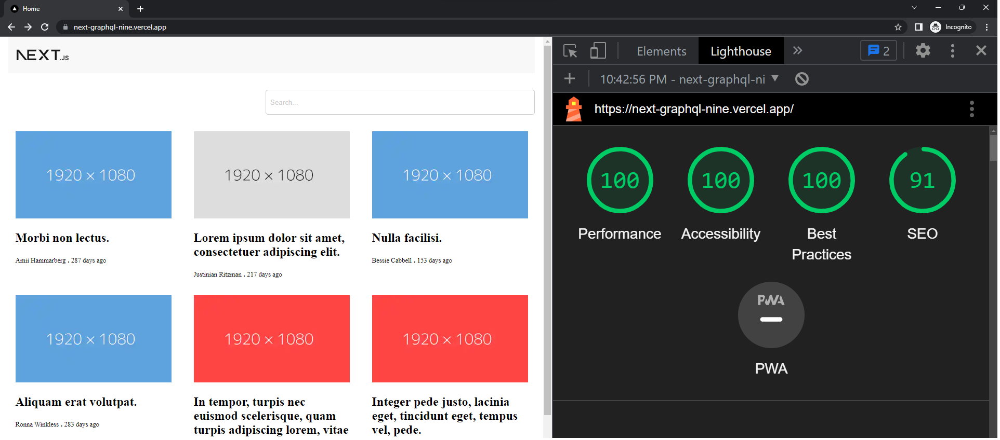

## Introduction

Live demo: https://storybook.readingmore.dev/



*SEO is not 100 due to "lorem ipsum" content :D

## Pre-requisites
- Node.js

## Installation

1. Clone the repository
2. Install dependencies

```bash
yarn
```
3. Create a .env file in the root directory and add the following environment variables
```bash
API_URL=your_api_url
```

4. Run the development server

```bash
yarn run dev
```

## Technologies used

- Next.js
- GraphQL
- graphql-request
- Storybook
- cypress

## Features

-  Display a list of articles
-  Display a single article
-  Search for articles
-  Responsive design
-  E2E tests

## Testing

Open the Cypress Test Runner
```bash
yarn cypress open
```

## Storybook

Open the Storybook
```bash
yarn storybook
```

## License

Distributed under the MIT License. See `LICENSE` for more information.

---

## Contact


buikhacnam11@gmail.com